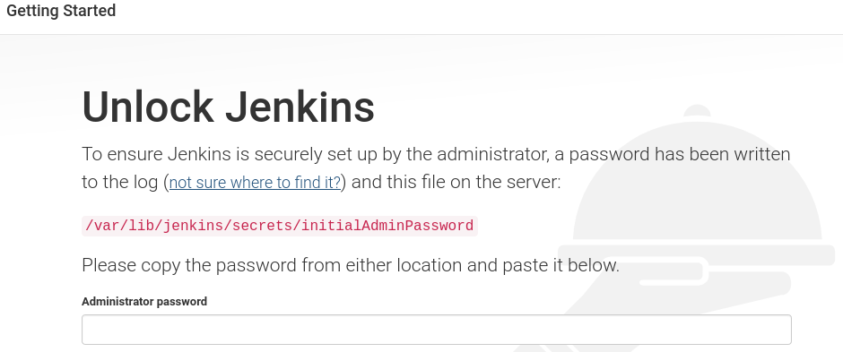
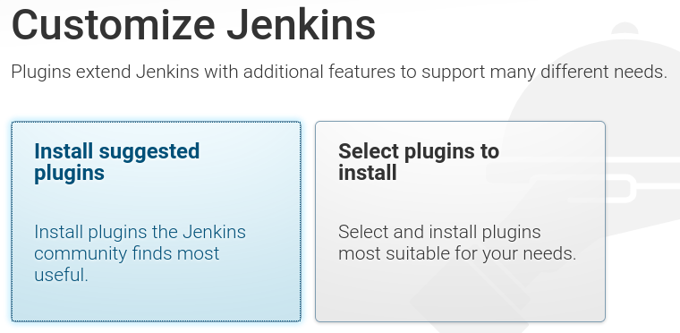
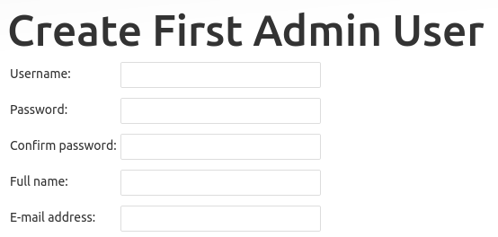
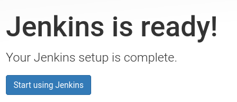
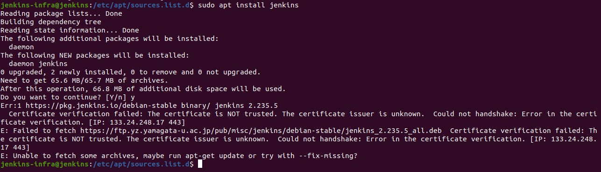
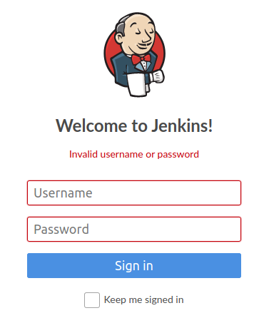
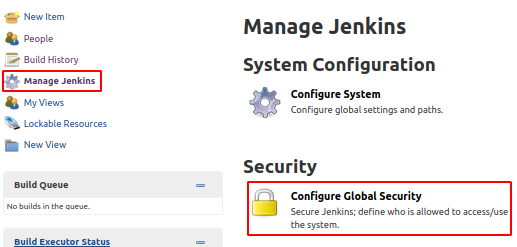
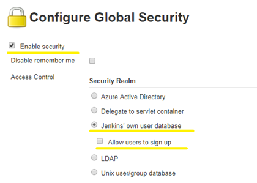
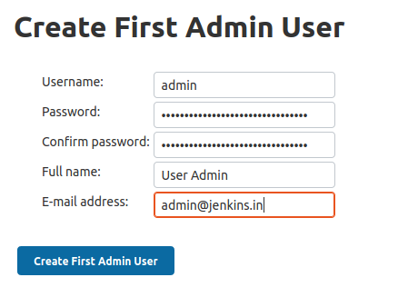

# Jenkins Installation

## Objective

This section aims to set up the required infrastructure of Jenkins to perform the task and solve the 2nd point of the [problem statement](https://intern-appsecco.netlify.app/problem-statement/) under Task 1.

**What is Jenkins?**

Jenkins is a self-contained, open-source automation server that can be used to automate all sorts of tasks related to `building, testing, and delivering or deploying` software.

Jenkins can be installed through native system packages, Docker, or even run standalone by any machine with a Java Runtime Environment (JRE) installed.

### Prerequisite

1. I installed VM with Ubuntu 18.04 server for [Installing Jenkins](https://www.jenkins.io/doc/book/installing/). I followed the steps under the Debian/Ubuntu section.

2. I also installed Java 8, by this [link](https://www.digitalocean.com/community/tutorials/how-to-install-java-with-apt-on-ubuntu-18-04#installing-specific-versions-of-openjdk) specific versions of OpenJDK on Ubuntu 18.04. I decided to go with this documentation as it was concise. 

## Installation steps of Jenkins.

### STEP 1 - Installing Jenkins

First, add the repository key to the system:

```
wget -q -O - https://pkg.jenkins.io/debian-stable/jenkins.io.key | sudo apt-key add -
```

The system will return `OK` 

Next, append the Debian package repository address

```
sudo sh -c 'echo deb https://pkg.jenkins.io/debian-stable binary/ > \
    /etc/apt/sources.list.d/jenkins.list'

sudo apt update
```

Finally, install Jenkins and its dependencies:

```
sudo apt install jenkins
```

### Step 2 — Starting Jenkins

I started Jenkins using systemctl command because systemctl is used to examine and control the state of “systemd” system and service manager.:

```
sudo systemctl start jenkins
```

Since systemctl doesn’t display output, I am using its status command to verify that Jenkins started successfully:
```
sudo systemctl status jenkins
``` 

If it's successfully installed, the beginning of the output should show that the service is **active** and configured to start for boot. Jenkins is running now. To reach it from a web browser I will adjust the firewall rules to complete the initial setup.

### Step 3 - Opening the Firewall

By default, Jenkins runs on port 8080, opening that port using ufw(Uncomplicated Firewall ):

```
sudo ufw allow 8080
```

To check the ufw's status confirm the new rules:

```
sudo ufw status
```

Note: If the status shows inactive. Then enable the firewall by following the following commands that will OpenSSH

```
sudo ufw allow OpenSSH
sudo ufw enable
```

### Step 4 — Setting Up Jenkins

Find the IP of your system:

```
ifconfig
```

To complete setup, in the browser I entered `http://your_server_ip_or_domain:8080`

The `Unlock Jenkins` screen opens, which will display where the initial password would be stored.



In the terminal window I will use the cat command to display the password:

```
sudo cat /var/lib/jenkins/secrets/initialAdminPassword
```

The 32-character alphanumeric password is displayed in the terminal, paste it into the Administrator password field, then click `Continue`. 

**Installing suggested plugins**



I clicked the `Install suggested plugins` option, which will immediately begin the installation process as shown:


Once the installation completes, the screen opens to `Create First Admin User`, I filled the required details.



Click on `Save and Continue` or select `Continue as admin` to skip the above step and continue as admin using the initial password used above.

The `Instance Configuration` page will be displayed which will ask to confirm the preferred URL for Jenkins instance.


Confirm the appropriate information, click `Save and Finish`. A confirmation page confirming that `Jenkins is Ready!`



Click `Start using Jenkins` to visit the main Jenkins dashboard.

Here finish the installation of Jenkins in VM.

-------------

## Errors resolved

These were errors that I faced during the installation. 

### 1. **GPG key error:**

An LTS (Long-Term Support) release is chosen every 12 weeks from the stream of regular releases as the stable release for that period time. 

The link gets updated, it gives GPG key error so find the latest link from [here](https://www.jenkins.io/doc/book/installing/#debianubuntu) under the Debian/Ubuntu section.

### 2. **Certificate verification failed**



To resolve this pass `--no-check-certificate` as shown below:

```
wget https://ftp.yz.yamagata-u.sc.jp/pub/misc/jenkins/debian-stable/jenkins_2.235_all.deb --no-check-certificate
```

Again reinstall the Debian file of Jenkins
```
sudo dpkg -i jenkins_2.235.5_all.deb
```

To fix the broken packages run:

```
sudo apt install -f
```

Now again I check the status of jenkins:

```
sudo service jenkins status
```

It SHOWS its active now.

### 3. **Invalid username or password**
   


Once logged in successfully into Jenkins VM (Virtual Machine). Go to directory `Jenkins` and open file `config.xml`.

```
sudo nano /var/lib/Jenkins/config.xml
```

This command will open `config.xml` file as below:


Go to <useSecurity> tag and check value, it will be `true`. 

You need to update <useSecurity> tag value to `false` as below.


 
Save this file.

Once you are done with updating value in the `config.xml` file. Restart Jenkin's service.

```
sudo service jenkins restart
```

It will show the status `active`.

Now on opening Jenkins URL. It will go to the dashboard direct. No credentials are required. After opening the dashboard `Logged in user` section will be blank. As it is now `Anonymous user`.

To reset all security options, go to `Jenkins` -> `Manage Jenkins` option in left-hand side option lists. 



Go to the `Configure Global Security` option

* Enable `Enable Security` option.
* In Security Realm Option Select `Jenkins own database` option.
* Unselect `Allow users to sign up` option under `Jenkins own database` option.
  


In `Authorization section` do the following changes :

* Select `Logged-in users can do anything` option (Tick).
* Unselect `Allow anonymous read access` option under `Logged-in users can do anything` option.
* Click `Save` button. 

You will be redirected to `Create First Admin User` page once you click on `Save` button.



Once you fill all the details, click on `Create First Admin User` button

You will be ready with new Admin users to log in again into the Jenkins portal. 


