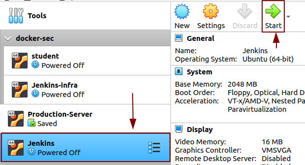

## Setting up VM

In this section we will we setting up two VMs:

1). For jenkins deployment.

2). For production Server to deploy the application (Odoo) on the server

Begin by creating a Virtual machine for Jenkins deployment.

**STEPS:**

1. Click on the `NEW` icon to create a new machine.
2. `Create Virtual Machine` window will open as shown in the picture.
   
   

Configure 
* The `Name` Jenkins-infra.
* The `Type` to Linux.
* `Version` to Ubuntu (64-bit).
* Allocate memory size.

Click on Create.

3. `Create Virtual Hard Disk` will open.
   
   

* Allocate the memory. 
* We will be setting the disk type to `VDI`
* Select storage on physical hard disk `Dynamically allocated`.
* Click create.

And that’s it! Your VM is ready for Ubuntu 18.04 installation.

Now download the server image 18.04 on VirtualBox as it is an LTS (Long Term Support) version which is a desirable feature for a CI pipeline. Follow the link `https://releases.ubuntu.com/18.04/`

**What is LTS?**

1. It is a product lifecycle management policy in which a stable release of computer software is maintained for a longer period of time than the standard edition.
2. The term is typically reserved for open-source software.

**Difference between Desktop Image and Server Image**

1. Desktop image is GUI(Graphical User Interface) based and Server Image is CLI(Command Line Interface) based.
2. Size of Desktop Image is (2.2 GB) and size of Server Image is (990.9 MB). So choose according to your system supports while running two VM's.

## Now begin with the installation of Ubuntu Server 18.04.5

Open the VM box and select the VM on which you want to install the server.
click on `Start`

When the window `Select start-up disk` window opens click on the folder.

A new window opens `Optical Disk Selector`. Select the server image and click `Choose`

Your server image is now selected so now click on `Start`

As you click on `Start` Jenkins VM start's running.

The installer is designed to be easy to use and have sensible defaults so for a first install you can mostly just accept the defaults for the most straightforward install.

Let's begin with installation:

**Language selection**

This screen selects the language and the default language for the installed system.

Press the `Enter` button.

**Keyboard configuration**

By default the English (US) layout and variant keyboard is selected.

Press the `Enter` button.

**Network**

 Configuration of the network is done from here and leave it default if no changes.

 Select `Done` and press `Enter`.

 **Configure proxy**

The proxy configured on this screen is used for accessing the package repository and the snap store both in the installer environment and in the installed system.

**Mirror**

The installer will attempt to use geoip to look up an appropriate default package mirror for your location. If you want or need to use a different mirror, enter its URL here.

**Guided Storage Configuration**

I kept the storage default and selected `Done`.
Press Enter button.

**Storage Configuration**

Once the storage configuration is confirmed, the install begins in the background.

Select continue. Press `Enter` to begin the installation.

**Profile Setup**

Fill the required details. Select `Done` and press the `Enter` button.

**SSH**

Select the option `Install OpenSSH server` because by default Ubuntu does not have SSH server installed. It has only SSH client installed. It is very common practice for administrators to SSH into the Ubuntu server so it's better to install the OpenSSH server here only with one click of a button.

Select `Done` and press the `Enter` button.

**Snaps**

If a network connection is enabled, a selection of snaps that are useful in a server environment are presented and can be selected for installation.

After that, select `Done` and press `Enter`.

**Installation logs**

Once the installation is complete, select `Reboot`. Press `Enter`.

Similarly the second VM can be installed.

Here we finish with the installation of `Ubuntu 18.04.05(LTS)` server.
