# Setting Up VM

## Objective

This section aims to set up the required infrastructure to perform the task and solve the 1st point of the [problem statement](https://intern-appsecco.netlify.app/problem-statement/) under Task 1.

In this section, I will be setting up two VMs:

1. For Jenkins deployment.
2. For the application(SuiteCRM) server.

## Steps for creating VM

1. I clicked on the `NEW` icon to create a new machine.
2. `Create Virtual Machine` window opened, as shown in the picture.
   
   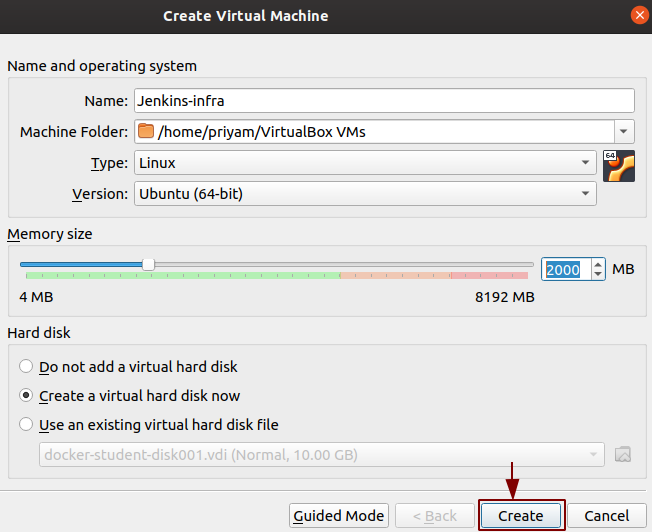

**Configuration**

* The `Name` Jenkins-infra.
* The `Type` to Linux.
* `Version` to Ubuntu (64-bit).
* Allocated memory size(RAM).

Clicked on `Create`.

3. `Create Virtual Hard Disk` will open.
   
   

* Allocated the storage. 
* Set the default disk type to `VDI(VirtualBox Disk Image)`
* Selected storage on physical hard disk `Dynamically allocated`.
* Clicked on `Create`.

VM is ready for Ubuntu 18.04 server installation.

To download the server image 18.04 on VirtualBox as it is an LTS (Long Term Support) version which is a desirable feature for a CI pipeline. I followed the official link [link](https://releases.ubuntu.com/18.04/).

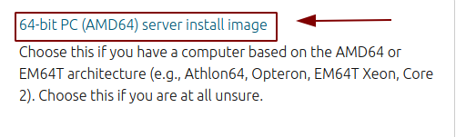

**What is LTS?**

1. It is a product life cycle management policy in which a stable release of computer software is maintained for a longer period than the standard edition.
2. The term is typically reserved for open-source software.
3. Ubuntu 18.04 server has 5 years of support.

## Installation steps for Ubuntu Server 18.04

I decided to install the Ubuntu Server 18.04 because my system was not able to support the Desktop Image of Ubuntu 18.04 server.

In the VM box, I selected the VM < Jenkins-infra > to install the server and click on `Start`.

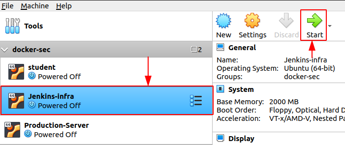

Then the `Select start-up disk` window opened and I clicked on the folder which gave a new screen `Optical Disk Selector`. I selected the server image and clicked on `Choose`.

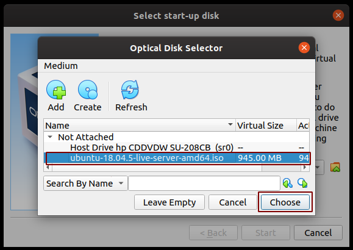

Server image is now selected and I clicked on `Start`.

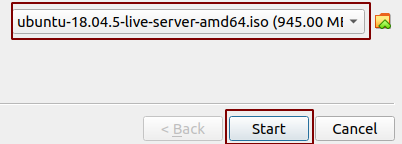

After clicking on `Start` Jenkins VM starts running.

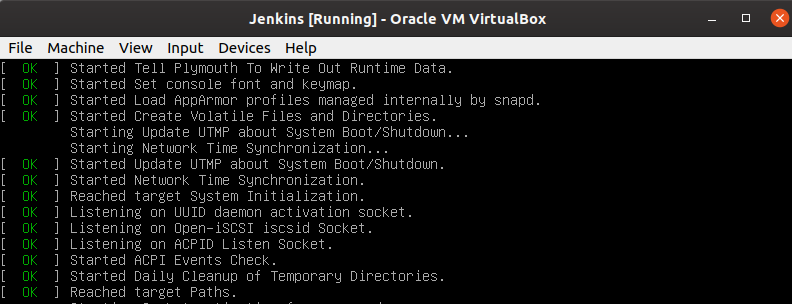

The installer is designed to be easy to use and have sensible defaults so for a first install I have mostly just accepted the defaults for the most straightforward installation. Beginning with installation:

**Language selection**

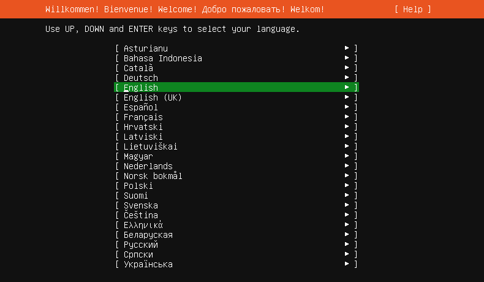

This screen selects the language. The default language for the installed system is selected as English as I did not want to make changes so pressed `Enter` button.

**Keyboard configuration**

By default, the English (US) layout and variant keyboard is selected as here also I do not want to make changes, pressed `Enter` button.

**Network**

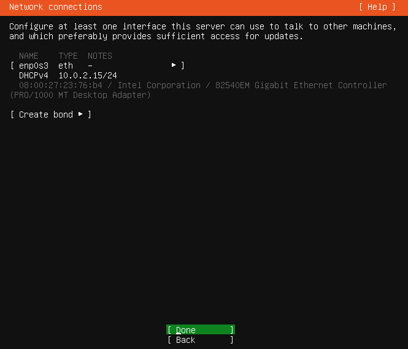

 Configuration of the network is done from here and I left it as default because I did not want to do any changes. Selected `Done` and pressed `Enter`.

 **Configure proxy**

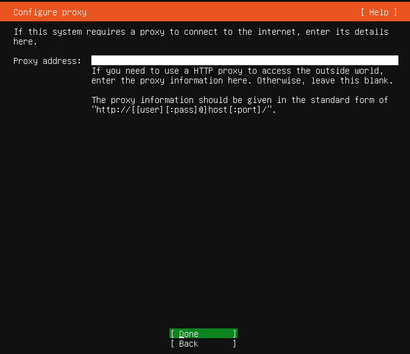

The proxy configured on this screen is used for accessing the package repository and the snap store both in the installer environment and in the installed system. I did not provide any `Proxy address`, kept it default and selected `Done`

**Mirror**

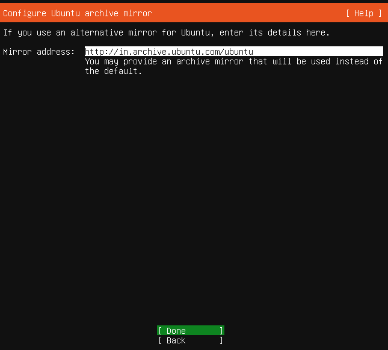

The installer will attempt to use GeoIP to lookup an appropriate default package mirror for your
location. I kept this too as default and selected `Done`  

**Guided Storage Configuration**

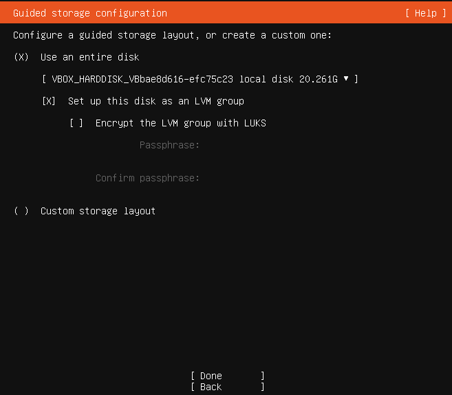

I do not have to make any changes to the storage configuration. So I selected `Done` and 
pressed the `Enter` button.

**Storage Configuration**

Selected `Done` and I did not make any changes.

Selected `continue` and pressed `Enter` to begin the installation.

**Profile Setup**

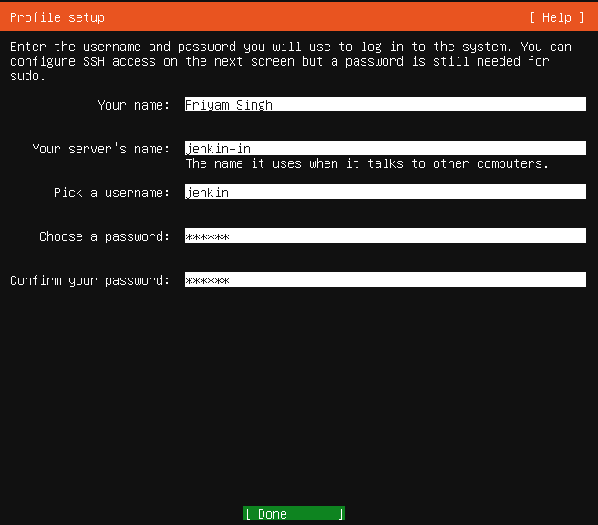

I filled the required details. Selected `Done` and pressed the `Enter` button.

**SSH**

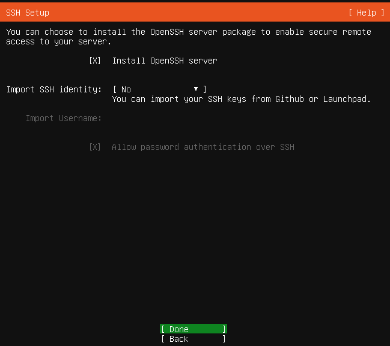

I Selected the option `Install OpenSSH server` because by default Ubuntu does not have an SSH server installed. It has only an SSH client installed. It is very common practice for administrators to SSH into the Ubuntu server so later on, I will also have to SSH to connect the two VMs. It is better to install the OpenSSH server here only with one click of a button.
Selected `Done` and pressed the `Enter` button.

**Snaps**

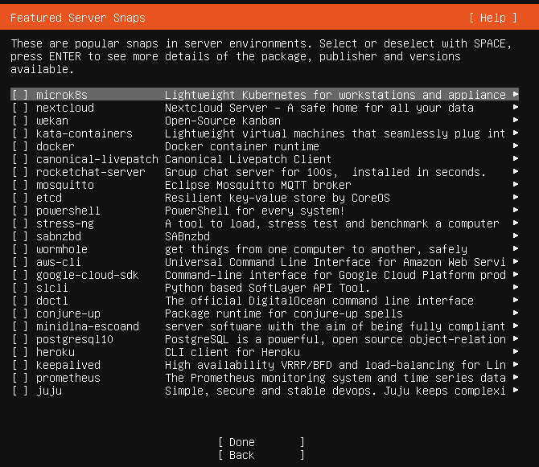

If a network connection is enabled, a selection of snaps that are useful in a server environment is presented and can be selected for installation.

After this, selected `Done` and pressed `Enter`.

**Installation logs**

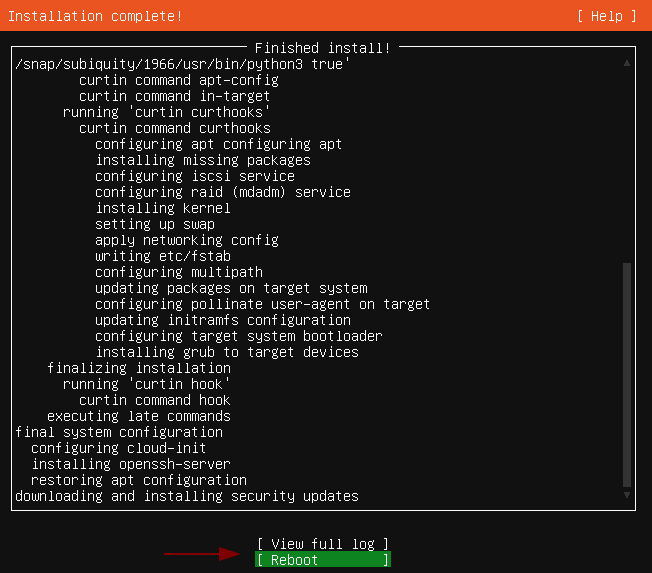

Once the installation is complete, I selected `Reboot` pressed `Enter` button. Similarly, the second VM can be installed. Here, I finished with the installation of `Ubuntu 18.04(LTS)` server.