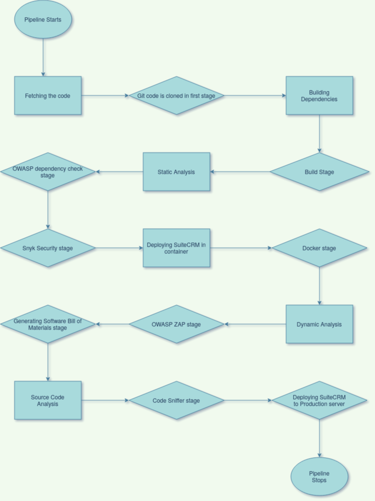

# Complete Pipeline Structure

## Objective
This section aims to define the final structure that is achieved for the pipeline after the various stages integrated into the pipeline as part of the solutions for all the tasks in the [problem statement](https://intern-appsecco.netlify.app/problem-statement/).

## Pipeline

When I completed with all the stages in the pipeline of fetching code from GitHub, building it, static scan, dynamic scan, generating SBOM, code quality analysis, deploying through Docker and doing DAST scan for the SuiteCRM, the final step was to combine all the stages which are being worked so far into a single pipeline as it was done in two pipelines just for it do not take a lot of time every time we build the pipeline.

### Diagrammatic representation

This is the Diagrammatic representation of the final Pipeline shown:



### Final Pipeline script

The final pipeline script that was the result of combining the two segregated pipelines and removing redundancies is mentioned below and also I copied the required files to the pwd like `Dockerfile` for `docker deployment` stage and the `python3_phpcs.py` script that is required for the stage `Code Sniffer for linting`:

```
pipeline {
    agent any

    stages {
        stage('git') {
            steps {
                git url: 'https://github.com/Priyam5/SuiteCRM.git/'
            }
        }
        
        stage ('Build') {
            steps {
                sh 'composer install'
            }
        }
        stage ('Dependency-Check Analysis'){
            steps {
                dependencyCheck additionalArguments: '', odcInstallation: 'OWASP Dependency-Check Plugin'
                dependencyCheckPublisher pattern: 'dependency-check-report.xml'
                sh 'mv dependency-check-report.xml /var/lib/jenkins/workspace/reports'
            }    
        }
        
         
        stage ('Snyk Security'){
            steps {
                snykSecurity failOnIssues: false, snykInstallation: 'Snyk Security Plugin', snykTokenId: 'snyk-api-token'
                sh 'mv snyk_monitor_report.json /var/lib/jenkins/workspace/reports'
            }    
        }

        stage ('docker deployment') {
            steps {
                sh 'docker build -t dockerimage:latest .'
                sh 'cp /var/lib/jenkins/workspace/config.php $(pwd)'
                sh 'docker run -v $(pwd):/var/www/html/suitecrm -d --rm --name dockerzap3 -p 1233:80 dockerimage:latest'
            }
        }

        stage ('OWASP ZAP') {
           steps {
                sh 'docker pull owasp/zap2docker-stable'
                sh 'docker run --network=host -v $(pwd)/zap-report:/zap/wrk/ -i owasp/zap2docker-stable zap-baseline.py -t http://192.168.1.2:1233/suitecrm/ -I -r zap_baseline_report.html -l PASS'
                sh 'docker rm -f dockerzap3'
           }
        }

        stage ('Generating SBOM'){
            steps {
                sh 'composer require --dev cyclonedx/cyclonedx-php-composer'
                sh 'composer make-bom'
                sh 'mv bom.xml /var/lib/jenkins/workspace/reports'
            }
        }
        
        stage ('Code Sniffer for linting'){
            steps {
                sh 'python3 python3_phpcs.py /var/lib/jenkins/workspace/suitecrm-pipeline'
            }
        }

        stage ('Deploying App to production server'){
            steps {
                sh 'echo "Deploying App to production Server"'
                sh 'ssh -o StrictHostKeyChecking=no production@192.168.1.4 "rm -rf suitecrm && mkdir suitecrm"'
                sh 'scp -r * production@192.168.1.4:~/suitecrm'
                sh 'ssh -o StrictHostKeyChecking=no production@192.168.1.4 "cd suitecrm && sudo cp -r * /home/production/html/suitecrm"'
                sh 'ssh -o StrictHostKeyChecking=no production@192.168.1.4 "sudo cp -r /home/production/config.php /home/production/html/suitecrm"'     
                sh 'ssh -o StrictHostKeyChecking=no production@192.168.1.4 "cd /home/production/html/suitecrm && sudo chmod -R 755 * && sudo chown -R www-data:www-data *"'
                
           }
        }
        
    }
}       
```        
