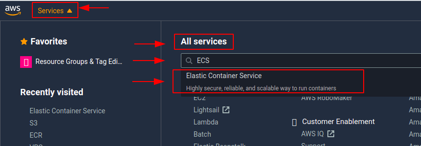
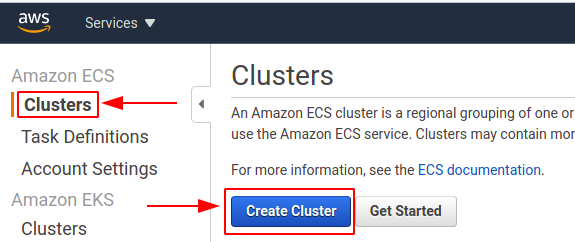

# Set up GitHub Actions Workflow for DAST

##  Objective 

This section aims to perform a DAST scan on [angular-realworld-example-app](https://github.com/gothinkster/angular-realworld-example-app) and generate a report to provide a solution to the 4th point of the [problem statement](https://cloud-native.netlify.app/problem-statement/) under Task 1.

## Setting Up the application manually

Firstly, I installed the application manually and ran it on my browser to know how it works. So I cloned the application in my terminal
```
git clone https://github.com/gothinkster/angular-realworld-example-app.git
```
* Install npm

```
sudo apt update
sudo apt install nodejs
sudo apt install npm
nodejs -v
```

* Install Yarn (https://classic.yarnpkg.com/en/docs/install/#debian-stable)
```
curl -sS https://dl.yarnpkg.com/debian/pubkey.gpg | sudo apt-key add -
echo "deb https://dl.yarnpkg.com/debian/ stable main" | sudo tee /etc/apt/sources.list.d/yarn.list
sudo apt update && sudo apt install yarn
export PATH="$PATH:`yarn global bin`"
yarn install
yarn -version
```
* Install Angular CLI(https://angular.io/cli)
```
npm install -g @angular/cli
```
* Got an error as on running `ng serve` opens editor instead of loading local URL. This is the terminal editor on the 'ng' alias. I uninstalled it with:
```
sudo apt purge ng-common ng-latin
```
Now again I ran `ng serve` and in the browser I typed `localhost:4200` (4200 is the default port). The application was successfully installed and window that opened is shown below:


## Setting Up the application through Docker

I firstly cloned the application and in the cloned folder made a file `Dockerfile`. In this, I used a node [image](https://hub.docker.com/_/node)
```
nano Dockerfile
```
I wrote this code in Dockerfile
```
#getting base image
FROM node

MAINTAINER Priyam Singh <2020priyamsingh@gmail.com>

RUN apt-get update
COPY . /src
WORKDIR /src

#Installing Angular CLI
RUN npm install
RUN npm install -y -g @angular-devkit/build-angular
RUN npm install -y -g @angular/cli

EXPOSE 4200
CMD ["ng", "serve", "--host", "0.0.0.0"]
```
* My application was not running on browser but it was getting compiled because I made a mistake that I was not writing "--host", "0.0.0.0" (--host 0.0.0.0 to listen to all the interfaces from the container).
* I was facing many errors such as packages getting failed so I removed my code of Yarn and only installed with Angular CLI

After this, I build the image
```
docker build -t angular5:latest .
```

Then ran the container
```
docker run --rm --name docker5 -p 1234:4200 angular5:latest
```
On the browser I opened `localhost:1234` it worked and the below window got opened.


## Setting Up application through AWS

### Installing AWS CLI in terminal
I followed this official link for the installation of [AWS CLI](https://docs.aws.amazon.com/cli/latest/userguide/install-cliv2-linux.html#cliv2-linux-install) and ran the below commands:

```
curl "https://awscli.amazonaws.com/awscli-exe-linux-x86_64.zip" -o "awscliv2.zip"
unzip awscliv2.zip
sudo ./aws/install
aws --version
```
I got the version output as shown below. It means AWS CLI is successfully installed.
```
aws-cli/2.0.56 Python/3.7.3 Linux/5.3.0-64-generic exe/x86_64.ubuntu.19
```

### Setting up AWS profile

For setting up AWS profile I followed this official[ documentation](https://docs.aws.amazon.com/cli/latest/userguide/cli-configure-quickstart.html). I ran the command `aws configure` to set up AWS CLI installation. It will ask for some information which we have to enter:
```
AWS Access Key ID [****************4529]: <Enter the ID>
AWS Secret Access Key [None]: <Enter the Access Key>
Default region name [None]: us-east-2
Default output format [None]: json
```
Then run the below command:
```
aws sts get-caller-identity
```
We will get the below output and our profile has been successfully configured:
```
"UserId": <"AWS Access Key ID ">,
    "Account": <"ACCOUNT NO.">,
    "Arn": "******"
```
### ECR 

Amazon Elastic Container Registry (ECR) is a fully-managed Docker container registry that makes it easy for developers to store, manage, and deploy Docker container images. Amazon ECR eliminates the need to operate our container repositories or worry about scaling the underlying infrastructure. Amazon ECR hosts our images in a highly available and scalable architecture, allowing us to reliably deploy containers for our applications. 

#### Creating an ECR Repository

To Create the ECR Repository I followed the below steps:

* I opened the Amazon ECR console
* In the navigation pane, choose `Repositories`
* On the Repositories page, choose `Create repository`
* In `Repository name`, enter a unique name for repository
* For `Tag immutability`, I choose the tag mutability setting for the repository. Repositories configured with immutable tags will prevent image tags from being overwritten
* For `Scan on push`, I choose the image scanning setting for the repository. Repositories configured to scan on push will start an image scan whenever an image is pushed, otherwise, image scans need to be started manually
* For `KMS encryption`, I choose to enable encryption of the images in the repository using AWS Key Management Service

#### Deleting an ECR repository

To delete an ECR repository I followed the below steps:

* I opened the Amazon ECR console

* In the navigation pane, I choose `Repositories`

* On the Repositories page, I selected the repository to delete and choose `Delete`

* In the Delete repository_name window, I verified that the selected repositories to be deleted and choose `Delete` option.

#### Pushing an ECR Repository

When we create a repository it shows commands for pushing. So we have to follow these commands and we can easily push the image to our ECR Repository.
```
aws ecr get-login-password --region us-east-2 | docker login --username AWS --password-stdin ${{ secrets.AWS_LOG }}.dkr.ecr.us-east-2.amazonaws.com  
docker tag angular5:latest ${{ secrets.AWS_LOG }}.dkr.ecr.us-east-2.amazonaws.com/angular-app-repo:latest
docker push ${{ secrets.AWS_LOG }}.dkr.ecr.us-east-2.amazonaws.com/angular-app-repo:latest
```

### Adding an image to ECR Repository through GitHub Actions

* I created a new file `image.yml` in the `.github/workflows`. 
* I stored my credentials in the secrets section of my application repository.
* I used this [plugin](https://github.com/marketplace/actions/configure-aws-credentials-action-for-github-actions) `"Configure AWS Credentials" Action For GitHub Actions` for AWS configuration.

* Below is the YML file:
```
name: "build image from Dockerfile"

on:
  push:
    branches: [master]

jobs:
  test:
    runs-on: ubuntu-latest
    
    steps:
    
    - uses: actions/checkout@v2
      
    - name: Install docker
      run: |
        sudo apt update
        sudo apt install apt-transport-https ca-certificates curl software-properties-common
        curl -fsSL https://download.docker.com/linux/ubuntu/gpg | sudo apt-key add -
        sudo add-apt-repository "deb [arch=amd64] https://download.docker.com/linux/ubuntu bionic stable" && sudo apt update
        apt-cache policy docker-ce
        sudo apt install docker-ce
        
    - name: Build Docker image
      run: |
        docker build -t angular5 .
    
    - name: Installing AWS CLI
      run: |
        curl "https://awscli.amazonaws.com/awscli-exe-linux-x86_64.zip" -o "awscliv2.zip"
        unzip awscliv2.zip
        sudo ./aws/install
        
    - name: Configure AWS Credentials
      uses: aws-actions/configure-aws-credentials@v1
      with:
        aws-access-key-id: ${{ secrets.DEMO_ID }}
        aws-secret-access-key: ${{ secrets.DEMO_K }}
        aws-region: us-east-2    
    
    - name: Pushing image to AWS
      run: |
        aws ecr get-login-password --region us-east-2 | docker login --username AWS --password-stdin ${{ secrets.AWS_LOG }}.dkr.ecr.us-east-2.amazonaws.com  
        docker tag angular5:latest ${{ secrets.AWS_LOG }}.dkr.ecr.us-east-2.amazonaws.com/angular-app-repo:latest
        docker push ${{ secrets.AWS_LOG }}.dkr.ecr.us-east-2.amazonaws.com/angular-app-repo:latest
    
```
After this, the image got successfully pushed to ECR.

## ECS

Amazon Elastic Container Service (ECS) is a highly scalable, high performance container management service that supports Docker containers and allows to easily run applications on a managed cluster of Amazon EC2 instances. It eliminates the need for us to install, operate, and scale cluster management infrastructure. 

### Setting Up ECS cluster

To create cluster I followed the steps given below and also followed the official [link](https://docs.aws.amazon.com/AmazonECS/latest/userguide/create_cluster.html).

For creating a cluster:

1. I clicked on `services` in the left upper corner and searched for ECS under `All services` and clicked  `Elastic Container Service`.

2. I selected `Clusters` option and then `Create Clusters`

3. For `Select cluster template`, I selected `Networking only` because I wanted to make it by Fargate as Fargate is a technology that can be used with Amazon ECS to run containers without having to manage servers or clusters of Amazon EC2 instances. With AWS Fargate, no longer have to provision, configure, or scale clusters of virtual machines to run containers., then I selected `Next Step`.

4. The next page opened, here I have to fill the `cluster name` and click `create`.

5. The `Launch status` page opened showing it is successfully created.

### Setting Up Service

Once the ECS cluster is created I can now create `Services` for the cluster. I followed this official [documentation]().

1. I firstly clicked on the cluster which I made and selected the `Service` option then clicked on `Create`. 

2. The next page `Configure service` opens

(a). In the `Launch Type` I selected `FARGATE` then filled the `Service name` and then in `NUmber of tasks` I typed 1. Other options I kept as default and then selected `Next step`.

(b). The next pages opened `Configure network` and `Set Auto Scaling` that too I kept default and selected the `Next step`

(c). Then `Review page` opens in which we can review the changes and finally create the service.

note: container was also created step missing
### Setting Up Task Definitions

* From the side bar select `Create new Task Definition` and the page opens to select `FARGATE` and click `Next step` 

* Over here give the `Task Definition Name` and `Task Role` select `ecsTaskExecutionRole` 

* `Task memory (GB)` select `0.5GB` and in `Task CPU (vCPU)` select `0.25 vCPU` and finally select `Create` option.

### Setting Up Task

### Setting Up YAML file for ZAP scan