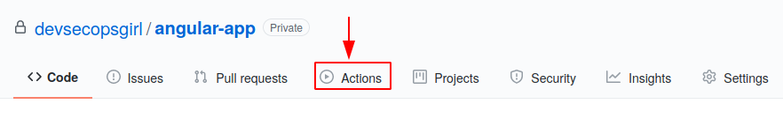

# SAST through Github Action

## Objective

This section aims to perform SAST for [angular-realworld-example-app](https://github.com/gothinkster/angular-realworld-example-app) and generate a report to provide a solution to the 1st point of the [problem statement](https://cloud-native.netlify.app/problem-statement/) under Task 1.

## SAST

Static analysis or Static application security testing (SAST), is a testing methodology that analyzes source code to find security vulnerabilities that make organization’s applications susceptible to attack. SAST scans an application before the code is compiled. It’s also known as white box testing. SAST takes place very early in the software development life cycle (SDLC) as it does not require a working application and can take place without code being executed. It helps in identifying vulnerabilities in the initial stages of development and quickly resolve issues without breaking builds or passing on vulnerabilities to the final release of the application.

## Github Action

GitHub Actions make it easy to automate all software workflows. Github Actions let us build, test, and deploy our code right from GitHub. We can also assign code reviews, manage branches, and triage issues the way we want with actions. GitHub Actions are designed to help in building robust and dynamic automation's.

Whether we want to build a container, deploy a web service, or automate welcoming a new user to our open-source project — there’s an automated action for that.

### Creating Workflow 

I followed this official link for [creating the first workflow](https://docs.github.com/en/free-pro-team@latest/actions/quickstart#next-steps).


* On GitHub, I forked ``angular-realworld-example-app`` and I created a new file in the `.github/workflows`

* I made the following YAML contents into the `sast-scan.yml` file. For knowing the syntax of Github action I followed [this](https://docs.github.com/en/free-pro-team@latest/actions/reference/workflow-syntax-for-github-actions#jobs) official link
```
name: "sast-scan"

on:
  push:
    branches: [master]

jobs:
  test:
    runs-on: ubuntu-latest
    
    steps:
    
    - uses: actions/checkout@v2
      
    - name: install dependencies
      run: | 
       sudo apt install npm
       sudo npm install --package-lock
       npm audit fix
          first 
     
    - name: OWASP Dependency Check
      run: |
       wget https://github.com/jeremylong/DependencyCheck/releases/download/v6.0.2/dependency-check-6.0.2-release.zip
       unzip dependency-check-6.0.2-release.zip
  
    - name: Run scan with ODC
      run: |
        dependency-check/bin/dependency-check.sh --project "angular-realworld-example-app" --scan .
```

* To run workflow, I scrolled to the bottom of the page and select Commit directly to the `main` branch. Then, to create a pull request, click `Propose new file`. Committing the workflow file in repository triggers the push event and runs workflow

### Viewing workflow results

1. On GitHub, I navigated to the main page of the repository.
2. Under repository name, click `Actions`. 

3. In the left sidebar, select the `workflow` to see under `All Workflows` section. From the list of workflow runs, I selected the name `sast-scan` of the run to see. 

4. In the left sidebar, I selected `test` and I can also check the `sast-scan.yml` by selecting `Workflow file`.


5. Expand the `test` to view the results and each step expanded further to see the logs. 


